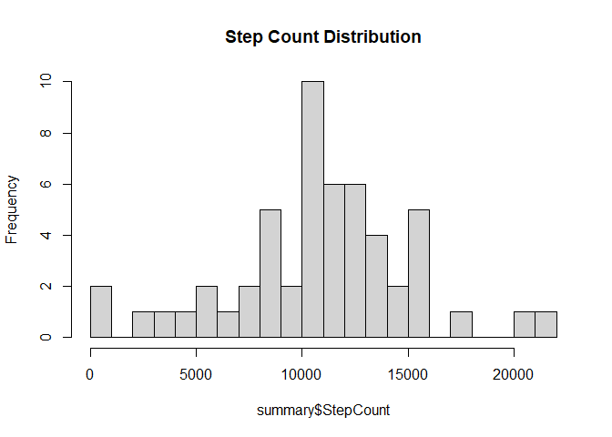
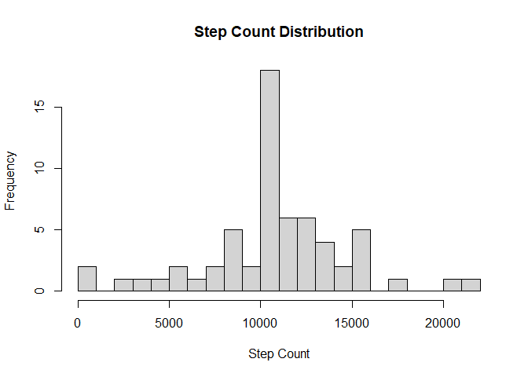

 

```r
knitr::opts_chunk$set(echo=TRUE,message=FALSE,warning=FALSE)
```

### 0) Dependencies

```r
library(tidyverse)
library(knitr)
library(lubridate)
```

### 1) Downloading and Importing the Data 

First, we will download the dataset, if necessary.

```r
if(!file.exists("activity.csv")){
        url <- "https://d396qusza40orc.cloudfront.net/repdata%2Fdata%2Factivity.zip"  
        dataset <- c("repdata_data_activity.zip")
        download.file(url,destfile=dataset,mode='wb')
        unzip(zipfile="./repdata_data_activity.zip")
}
```

Next, import the data into RStudio and adjust column formats as necessary

```r
activity <- read.csv("activity.csv")
activity$date <- as.Date(activity$date)
activity$interval <- as.numeric(activity$interval)
```

### 2) Calculate Mean/Median of Daily Step Data and plot histogram

Create summary subset and calculate mean/median, ignoring missing values


```r
summary <- activity %>%
        group_by(date) %>%
        summarise(StepCount=sum(steps))

mean(summary$StepCount,na.rm=TRUE) 
```

```
## [1] 10766.19
```

```r
median(summary$StepCount,na.rm=TRUE)  
```

```
## [1] 10765
```

Next, plot the distribution of the data in a histogram


```r
hist(summary$StepCount,breaks=20,main="Step Count Distribution")
```

<!-- -->

### 3) Average Daily Pattern

First, calculate the average steps taken in each 5 minute interval and 
determine maximum value. 


```r
five_m_intervals <- activity %>%
        group_by(interval) %>%
        summarise(AvgSteps=mean(steps,na.rm=TRUE))

MaxSteps <- five_m_intervals %>% slice_max(order_by=AvgSteps,n=1)
MaxSteps
```

```
## # A tibble: 1 x 2
##   interval AvgSteps
##      <dbl>    <dbl>
## 1      835     206.
```

Now plot the Average Daily Step Count


```r
ggplot(data=five_m_intervals, aes(x=interval)) + 
        geom_line(aes(y=AvgSteps)) +
        labs(title="Average Daily Pattern",x="Interval",y="Average Step Count")
```

<!-- -->

### 4) Missing Values

In order to account for missing values (NAs), we will use the average calculated
for each time interval. First, count how many missing values we have to replace.


```r
missingvalues <- sum(is.na(activity$steps))
missingvalues
```

```
## [1] 2304
```

Next, we need to replace the NAs with the average values for each interval, 
using the merge and coalesce functions. 


```r
activity_imputed <- activity %>% 
        merge(five_m_intervals[,c("interval","AvgSteps")], by="interval") %>% 
        mutate(steps=coalesce(steps,AvgSteps)) %>%
        select(steps,date,interval) %>%
        arrange(date)
```

Calculate new mean and median for adjusted dataset.


```r
summary_imputed <- activity_imputed %>%
        group_by(date) %>%
        summarise(StepCount=sum(steps))

mean(summary_imputed$StepCount)  
```

```
## [1] 10766.19
```

```r
median(summary_imputed$StepCount)
```

```
## [1] 10766.19
```

Finally, plot the data in a histogram.


```r
hist(summary_imputed$StepCount,breaks=20,main="Step Count Distribution",
     xlab="Step Count")
```

<!-- -->


### 5) Weekday/Weekend Differential

We add a column to the data that designates "Weekday" or "Weekend" and summarize
the data.


```r
activity_days <- activity_imputed %>%
                        mutate(date=as.Date(strptime(activity_imputed$date,
                                                     format="%Y-%m-%d"))) %>%
                        mutate(day=weekdays(activity_imputed$date)) %>%
                        mutate(day=ifelse(day %in% c('Sunday','Saturday'),
                                          'Weekend','Weekday'))

summary_days <- activity_days %>%
        group_by(interval,day) %>%
        summarise(StepCount=mean(steps))
```

Finally, plot the data


```r
ggplot(data=summary_days, aes(x=interval)) + 
        geom_line(aes(y=StepCount)) +
        facet_wrap(~day,nrow = 2,ncol = 1) +
        labs(title="Weekday vs Weekend Step Count Data",
             x="Interval",y="Average Step Count")
```

<!-- -->

There are some differences in the weekend and weekday data, most noticeably with
the weekend data being more evenly distributed throughout the day and a smaller
peak in the morning.
